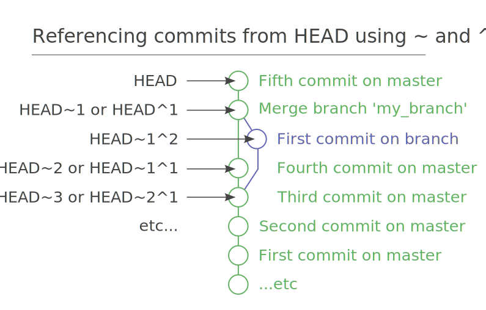

# Git Commits

## Commit Reference

### Ancestor`~` and Parents `^`

Recall that `HEAD` or branch name are special named pointers referencing certain commit object. In addition, we can use ancestor `~` and parents `^` to reference predecessor of a specified commit pointer. 

- The tilde `~n` means n commits from a commit pointer. 
- The caret `^n` means nth parent of a commit pointer if it is a merge commit. Typically a merge commit has two parents, thus `HEAD^1` is the father and `HEAD^2` is the mother. 



### Commit Range with Double Dots `..` and Triple Dots `...`

Commit range `c1..c2` means all commits between `c1` exclusive and `c2` inclusive. 

```shell
# show HEAD~3 HEAD~2 HEAD~1 HEAD
$ git log HEAD~4..HEAD
# show all commits in testing branch but not in master branch
$ git log master..testing
```

Commit range `master...testing` shows all commits in two branches that have not yet been merged, equivalent to `master..testing` and `testing..master` combined. 

## Track Changes

### Stage Files

Use `git add <file>` to add the file to staging area, which **tracks new file or stage modified file**. Note it means "add this content to the next commit". 

Note file in staging area is a snapshot of the exact state of the file when `git add` is executed. The the file is modified after `git add`, it can be in both staged and modified state. We need to execute `git add` again to add the latest change to staging area. 

### Commit Files

Use `git commit` to create a snapshot for **everything in the staging area**. 

- `git commit -m "comment"`: type commit message inline. 
- `git commit -am "comment"`: stage all modified files, then commit. Note it does not work with untracked files. 
- `git commit --amend` **appends current staging area to last commit**, and give you a chance to **change the commit message**. Note last commit is replaced by amended commit. Note redo commit may cause issue if it is done after a `git push`. 

### Stash Files

When we are working on a project in a messy state, but need to switch branch or make a merge, we need to put away the work temporarily. 

Use `git stash` to put the work into a stack, then you will have a clean working directory. 

After you come back to continue the work, use `git stash pop` to retrieve the previous work and remove it from the stack. 

```shell
# create a stash with uncommitted changes
$ git stash
# see the list of available stashes
$ git stash list
# result might be something like:
stash@{0}: WIP on master: 273e4a0 Resize issue in Dialog
stash@{1}: WIP on master: 273e4b0 Silly typo in Classname
stash@{2}: WIP on master: 273e4c0 Silly typo in Javadoc
# you can use the ID to apply a stash
$ git stash apply stash@{0}
# or apply the latest stash and delete it afterwards
$ git stash pop
# you can also remove a stashed change
# without applying it
$ git stash drop stash@{0}
# or delete all stashes
$ git stash clear
# create a new branch from your stack and switch to it
$ git stash branch newbranchforstash
```

### Remove Files

When we `rm` a file in the file system, the file is only put into **modified but unstaged** state. To make Git reflect on this change, we still need to stage it and commit. 

- `git rm <file>` **removes** the file from file system, then stage the change automatically. 
- `git rm --cached <file>` **untracks** a file from git, but keep it in the file system. 

Note we still need to **commit the removal**. 

### Rename Files

When we `mv` a file in the file system, the file is put into **modified but unstaged state while a new untracked file is created**. 

Use `git mv <old> <new>` to facilitate the process. It is equivalent to three commands. 

```shell
$ mv README2 README
$ git rm README2
$ git add README
```

Still, remember to **commit the rename**. 

## Undo Changes

### Double Dash `--`

The **double dash `--` marks the end of option**, thus separates the Git object such as commit and branch, from file path. For instance it separates a file named `HEAD` and a commit pointer `HEAD`. 

```shell
# seeing the git log for the HEAD file
$ git log -- HEAD
# seeing the git log for the HEAD reference
$ git log HEAD --
# if there is no HEAD file you can use HEAD as commit reference
$ git log HEAD
```

### Unstage a File

Unstage a file moves the file out of staging area **back to its original untracked or modified** state. 

- `git reset HEAD -- <file>` to unstage. 
- `git config --global alias.unstage 'reset HEAD --' `.  

### Unmodify a File

Unmodify a file discards all changes to a modified file, and use the **snapshot from last commit to copy over** the file. 

- `git checkout HEAD -- <file>` to check out specified file content from last commit into the working directory.
- `git checkout HEAD~2 -- <file>` to check out specified file content in third last commit into the working directory. 
- `git config --global alias.unmodify 'checkout HEAD --'`. 
- Note if the file is not in the previous commit, the command fails. 

### Backtrack Commit

We want to start a **new branch from a previous commit**, which require us to move the `HEAD` pointer to an early commit. 

- `git checkout HEAD~2` to restore entire working directory to third last commit. 
- Note the `HEAD` does not point to any branch at the moment which is dangerous. From here we **should make a new branch immediately**. 

### Revert Commit

We have some changes that has already been committed, but we want to **discard these committed changes**. Git make the revert by find out the changes in those commit, recover the state of working directory before the changes, then **make a new commit for the reverted state**. 

- `git revert HEAD~3`: Revert the changes specified by the fourth last commit in current branch, and create a new commit with the reverted changes.
- `git revert topic~5..topic~2`: Revert the changes done by commits range from the fifth last commit in topic(exclusive), to the third last commit in topic (inclusive).

## Analyze Changes

### View Changes

Use `git show <commit>` to see changes introduced by **a commit**. 

Use `git diff HEAD~3 HEAD` to see difference between **two specified commits**. 

Use `git diff HEAD~3..HEAD` to see difference between **a range of commits**. 

Use `git diff` to see difference between **working directory and stage area**. It shows all changes if stage area is clean. 

Use `git diff <file>` shows difference between **working directory and staging area**. 

Use`git diff --cached <file>` shows difference between **staging area and last commit**. 

Use `git diff HEAD -- <file>` to see difference for a specific file between **last commit and working directory**. 

> **[info] NOTE:** `git diff` does not show untracked file. 


> **[info] NOTE: ** `@@-43,7 +2,8@@` means that following is a display of 7 lines starting line 43 in first file, and 8 lines starting line 2 in second file. 

### View History

Use `git log` to display the change history, at **commit level**.

Use `git log HEAD~10` to display history from `HEAD~10` commit.

Use `git log -p` to display history with diff.

Use `git log -- <file>` to display history for specific file. 

Use `git log --no-merges branchA..branchB`: only show commits that are on `branchB` but not on `branchA`. 

Use `git log -2` to show last 2 commits. 

#### Log Parameters

- `git log --oneline`: format information for each commit to one line. 
- `git log --graph`: show a graphic history tree.
- `git log --abbrev-commit`: show shortened commit hash. 
- `git log --decorate`: add named commit pointers to log output. 
- `git log --pretty=format: "%h - %s"`: custom format information for each commit, showing hash and subject for instance.
- `git log --since="2008-10-01" --until="2008-11-01"`: output commits within given range.
- `git log --author=gitster`: output commits by author name `gitster`. 
- `git log --grep="workspace" `: filter with regex pattern.
- `git log --no-merges`: hide merge commits. 

```shell
$ git log --pretty="%h - %s" --author=gitster \
	--since="2008-10-01" --before="2008-11-01" --no-merges -- t/
$ git log --graph --pretty=format:'%Cred%h%Creset -%C(yellow)%d%Creset %s %Cgreen(%cr) %C(bold blue)<%an>%Creset%n' --abbrev-commit --date=relative --branches
```

### Use Patches

Use `git format-patch` to generate patches for commits. 

- `git format-patch <commit>` generate **serials of patches** since the specified commit (exclusive) until `HEAD`. 
- `git format-patch HEAD~3..HEAD` generate serials of patches for the commit range. 
- `git format-patch -1 HEAD~2` generate patches since the 1 commit (exclusive) before `HEAD~2` until `HEAD~2`. In this case it is `HEAD~2` only. 

Use `git am *.patch` to apply a patch. 

### Tag Commits

Use `git tag` to manipulate tags for commits.

- `git tag`: list all the tags in lexicographic order.
- `git tag -l "v10.0*"`: list tags matching specified pattern.
- `git tag -a v0.1 -m "version 0.1"`: create an annotation tag named "v0.1" with message "version 0.1".
- `git tag -a v1.0 -m "version 1.0" <commit>`: add a tag for specific commit given its hash. 
- `git show v0.1`: display information for tag `v0.1`. 
- `git push origin --tags`: note `git push` will not automatically push tags to remote server. add `--tags` options to do so. 

### Find Regression Commit

Use `git bisect` to find the first regression commit with binary search. 

```shell
# start the bisect process
$ git bisect start
# mark current/latest commit as bad
$ git bisect bad
# mark the first known good commit
$ git bisect good HEAD~7
# git checkout a commit between good and bad for testing
Bisecting: 3 revisions left to test after this (roughly 2 steps)
[44b9c28e8fd375718534231c61d11c469b0e4c91] add test2
# run some tests with current commit
$ <testpath>/test
# inform git the test result for this commit
$ git bisect bad				
# git checkout a commit between good and new bad using binary search
Bisecting: 0 revisions left to test after this (roughly 1 step)
[0e4d7bb55f0a5bf045292719ad350bc3449634ec] Revert "2nd"
# run some tests with current commit
$ <testpath>/test
# inform git the test result for this commit
$ git bisect good
# repeat the binary search and test, until the first bad commit is found
44b9c28e8fd375718534231c61d11c469b0e4c91 is the first bad commit
# optionally we can ask git to run the diagnostic test automatically and do the binary search based on its result
$ git bisect run <testpath>/test
# check out search log
$ git bisect log
# stop the bisect process
$ git bisect reset
```

> **[info] NOTE:** make sure the test script is placed at an external path or untracked by the git repo. Otherwise the script itself may be overwritten as git checkout commits. 

## Guideline for Commits

1. Use `git diff --check` to avoid **whitespace error**.
2. Make each commit a logically separate and digestible changeset. 
3. Commit message: 
   - single line of 50 character summary. 
   - a blank line. 
   - detail explanation with 72 character per line. 
   - use imperative present tense such as ''add tests". 