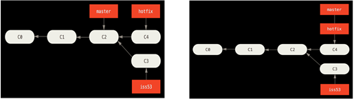
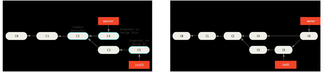

# Git Branch

## Manage Branches

### View

Use `git branch`, without any branch name, to list all the branches.

- `git branch -a`: list all branches including remote branches. 

- `git branch -v`: list branches and their last commit. 

- `git branch --merged`: list branches that are already merged to base branch. Branches in this list other than base branch are safe to delete. 

- `git branch --no-merged`: list branches that contains work not merged to base branch yet. You cannot delete them unless use force delete. 

- `git log --graph --pretty=oneline --abbrev-commit`: display commit path as trees.

  ```shell
  git config --global alias.tree "log --graph --pretty=format:'%Cred%h%Creset -%C(yellow)%d%Creset %s %Cgreen(%cr) %C(bold blue)<%an>%Creset%n' --abbrev-commit --date=relative --branches"
  ```

### Create

Use `git branch <branch name>` to create a new branch. 

> **[info] Note:** It basically creates a new pointer pointing to current commit object. But it **does not move the`HEAD` pointer** so we are still on the original branch. 

Use `git checkout -b <new branch name>` to create a new branch then immediately switch to it. 

### Switch

Use `git checkout <branch name>` to switch to a branch. 

Note two things happen after the command:

- `HEAD` pointer now points to the new branch.
- Files in working directory is changed based on snapshot of the new branch. 

### Delete

Use `git branch -d <branch name>` to delete a branch, that has been merged to base branch. 

Use `git branch -D <branch name>` to force delete a branch. 

### Rename

Use `git branch -m <old_name> <new_name>` to rename a branch. 

## Merge Branches

We have a base branch and a topic branch, and we want to merge the topic branch into the base branch so that **commits in topic branch becomes part of base branch commit history** as well. 

Use `git merge topic` to merge changes of topic branch into **current branch**. 

Use `git merge topic base` to merge changes of topic branch into specified branch if not current branch. 

> **[info]Note:** pointer of current branch or specified branch is the one be moved. 

There are two types of merging: 

- Fast-forward

If base branch is the ancestor of the topic branch, Git will use fast forward to simply move base branch pointer to same position of topic branch. 



- Three-way

if base branch is not a direct ancestor of the topic branch, Git do a three-way merge. It applies changes in both branches with respect to **their common ancestor**, then creates a new commit object pointing to both branches, called **merge commit**. Base branch is then moved to this newly created commit object. 



### Resolve Merge Conflicts

If **two branches make changes to the same file**, three-way merge raises a conflict. To resolve the conflict: 

- run `git status` to find out all **files with a merge conflict** in the `unmerged paths` section.  

- Git **adds conflict-resolution markers directly to the files**. Above the divider is the base branch and below is the topic branch. We need to edit each file manually to remove conflict, and the dividers.

```json
  <<<<<<< HEAD:index.html
  <div id="footer">contact : email.support@github.com</div>
  =======
  <div id="footer">
  please contact us at support@github.com
  </div>
  >>>>>>> iss53:index.html
```

- If you want to simply pick one the version as merged file, use `--ours` and `--theirs` modifier to select the version.

```shell
# pick the file on base branch
git checkout --ours foo/bar.java
# pick the file on topic branch
git checkout --theirs foo/bar.java
```

- run `git add` on each file to mark it as resolved. 
- run `git commit` to conclude the merge, after all files are resolved. 

## Rebase Branches

We have a base branch and a topic branch bifurcate at some point, and we want to **remove the bifurcation to create a single path of commit history**.  It is often done to clean up history before push to remote repo. 

### Rebase

We do it with rebase since 3-way merge could not. Rebasing takes all changes in one branch from the common ancestor, the **entire commit path**, and applies it onto another branch by creating a **replacement path**. Note replacement path may include multiple commits. 


Use `git rebase <base> <topic>` to move the commit path of topic branch onto base branch. 

> **[info]Note: ** order of branch is different for rebase than merge. 

> **[danger]Caution: ** **Do NOT rebase commits that exist outside your repository**, i.e. remote repository checked out by others. After rebase, the original commit path is removed. However if the commit path has already been pushed to remote repository, such changes in commit history may confuse other collaborators. 

### Squash

When doing the rebase, entire commit path of topic branch is copied commit by commit onto base branch as replacement path. We want to **squash the path into a single commit** to make it more compact. 

Use `git merge --squash topic base` to take all the work on topic branch, squashes it into **a single replacement changeset**, and copy to base branch. 

> **[info]Note: **the **changeset is placed in staging area** and not committed yet. When next commit happens, a single commit on base branch including all the changes is created. 

> **[info]Note: ** topic branch is **not really merged** into base. It needs force delete to remove. 

### Interactive Rebase

Interactive rebase allows finer manipulation over the commit path history when rebasing.

Use `git rebase -i base topic` to enter interactive rebasing mode. For each commit in the commit path of topic branch, one can perform following actions: 

| Action | Description                              |
| ------ | ---------------------------------------- |
| pick   | includes the selected commit, moving pick entries enables reordering of commits |
| skip   | removes a commit                         |
| edit   | amends the commit                        |
| squash | combines the changes of the commit with the previous commit and combines their commit messages |
| fixup  | squashes the changes of a commit into the previous commit discarding the squashed commit’s message |
| reword | similar to pick but allows modifying the commit message |

### Cherry-pick

Instead of entire commit path of a branch, one can **apply specific commit from the topic branch onto the base branch**. A **new commit** is created on base branch to integrate all changed the cherry-picked commits introduced. 

```shell
$ git checkout base
$ git cherry-pick <commit> 
$ git cherry-pick topic~3..topic
```

